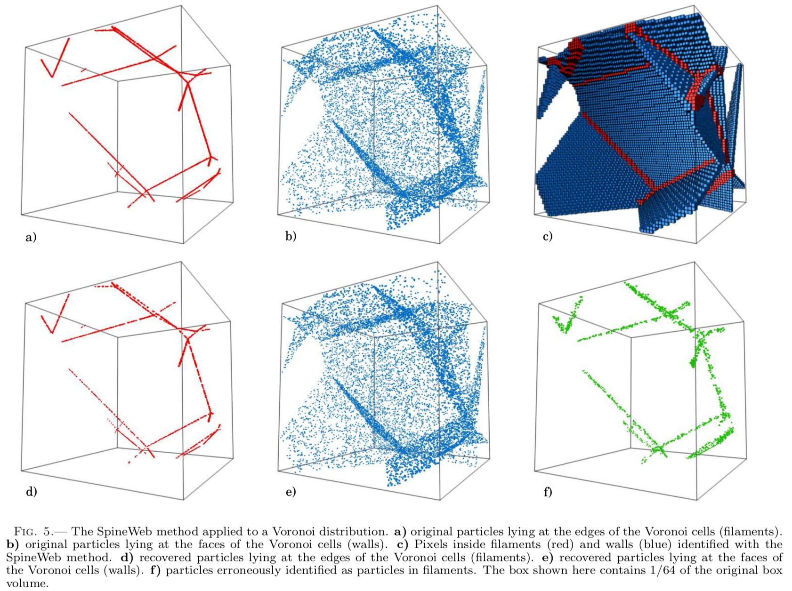
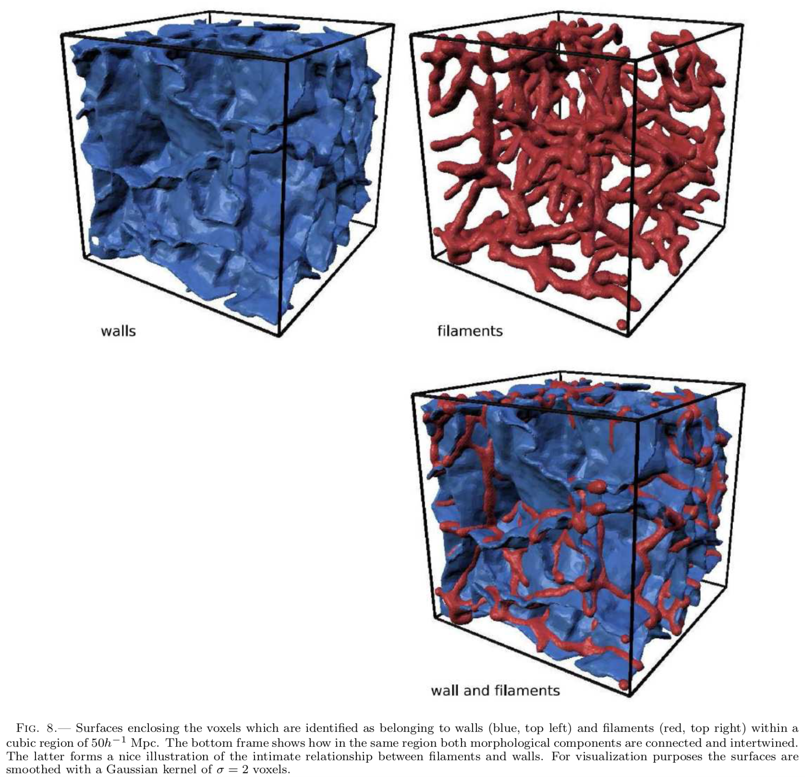

## SpineWeb algorithm for filament, wall and void finder

[Get the paper here](http://adsabs.harvard.edu/abs/2010ApJ...723..364A)

***
***

The SpineWeb method is based on the watershed transform. If we make the analogy of a density field as a landscape then the valleys correspond to voids and the ridges to filaments. For tridimensional scalar fields we can note that the boundaries between two voids form two-dimensional walls and the intersection of three or more voids form one-dimensional ridges or filaments. This is the main idea behind the SpineWeb method. 

The most recent implementation is more self consitent and defines walls as the intersection of voids, filaments as the intersection of walls, and clusters as the intersection of filamnets.

***

***

